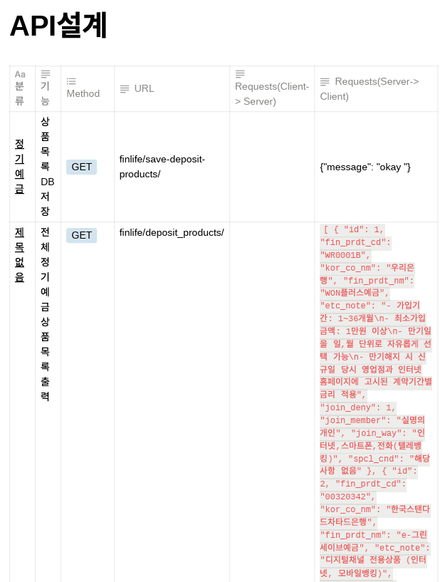
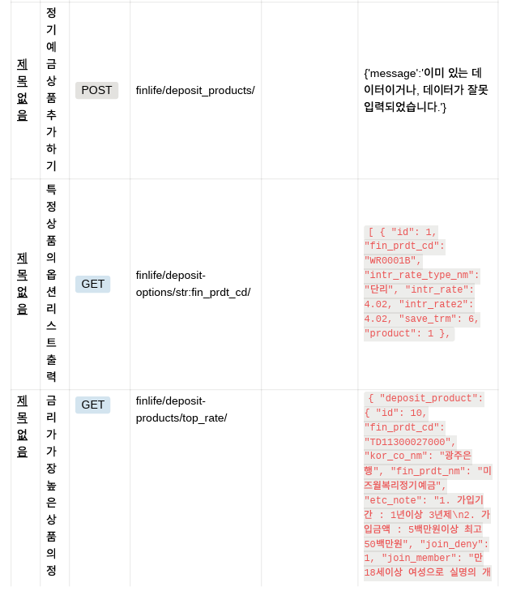

### 팀 구성원
: 윤채송, 이재평

### A. 정기예금 상품 목록 및 옵션 목록 저장

- **내용:**
    - 데이터 수집 및 저장: 외부 API에서 데이터를 가져오고, Django의 ORM을 사용하여 데이터베이스에 저장하였습니다.
    - API 통신: requests 모듈을 사용하여 외부 API와 사용하였습니다.
    - 데이터베이스 모델: 데이터 모델을 정의하고 모델 간의 관계를 설정했습니다.

- **성취 및 느낀점:**
    - 데이터 수집 및 저장 프로세스를 구현하면서 데이터 관리 및 데이터베이스 모델링에 대한 이해가 깊어졌습니다.
    - 외부 API와의 상호작용을 구현하면서 실제 데이터 소스와의 통합에 대한 경험을 얻었습니다.

### B. 전체 정기예금 상품 목록 출력

- **내용:**
    - Django 뷰(View): API 엔드포인트를 생성하고, GET 및 POST 요청을 처리하였습니다.
    - HTTP 메서드: GET 및 POST 요청을 통해 데이터를 읽고 쓰는 방법을 이용했습니다.

- **성취 및 느낀점:**
    - 데이터를 클라이언트에 제공하는 방법을 이해하고, HTTP 메서드를 활용하여 클라이언트의 요청을 처리할 수 있게 되었습니다.
    - API 엔드포인트를 통해 데이터에 접근하는 방법을 이해하면서 웹 애플리케이션 개발의 핵심 개념을 파악했습니다.

### C. 정기예금 상품 추가하기

- **내용:**
  - POST 요청 처리: POST 요청을 통해 클라이언트에서 데이터를 서버로 전송하고, 서버에서 이를 처리하였습니다.
  - API 테스트 도구 활용: Postman을 사용하여 API 요청을 테스트하고, 데이터를 서버에 추가했습니다.

- **성취 및 느낀점:**
  - 클라이언트가 서버에 데이터를 제출하는 프로세스를 이해하고, 데이터 유효성 검사 및 저장을 구현하는 데 성공했습니다.
  - API 요청을 테스트하는 도구를 활용하여 개발 중에 데이터의 유효성을 확인하는 중요성을 깨달았습니다.

### D. 특정 상품의 옵션 리스트 출력

- **내용:**
  - 동적 URL 경로: URL 경로에 매개변수를 사용하여 동적 데이터를 반환하였습니다.
  - 외래 키 관계: 데이터 모델에서 외래 키를 사용하여 데이터 간의 관계를 설정했습니다.

- **성취 및 느낀점:**
  - 동적 URL 경로를 활용하여 특정 데이터를 동적으로 제공하는 방법을 이해하게 되어 효율적인 데이터 검색을 위해 유용하다는 것을 깨달았습니다.
  - 데이터 모델 간의 관계를 설정하여 관련 데이터를 추출하고 제공하는 방법을 숙지했습니다.

### E. 금리가 가장 높은 상품의 정보 출력

- **내용:**
  - 데이터 정렬 및 필터링: 데이터를 정렬하고 필터링하여 가장 높은 값을 가진 데이터를 갱신하는 방법을 통해 구현했습니다.

- **성취 및 느낀점:**
  - 데이터를 정렬하고 필터링하여 원하는 결과를 얻는 기술을 향상시켰습니다.

이번 관통 프로젝트를 통해 Django를 활용한 웹 애플리케이션 개발, RESTful API 디자인, 외부 데이터 소스와의 상호작용, 데이터 모델링, HTTP 프로토콜을 활용하는 방법 등 다양한 웹 개발 기술을 습득하였고, 얻은 지식을 실무에서 활용할 자신감을 얻었습니다.

### API 설계
---
https://www.notion.so/682b53def7634d6c92e2c83769ec35c3?v=66264b2ea11a42c99018576b7e84c64e&pvs=4

### 트러블 슈팅
---
- GET 요청을 보낼 때마다 DB에 데이터를 저장한다
  - 중복된 데이터는 저장하지 않는다는 로직을 작성해야 할 것 같다