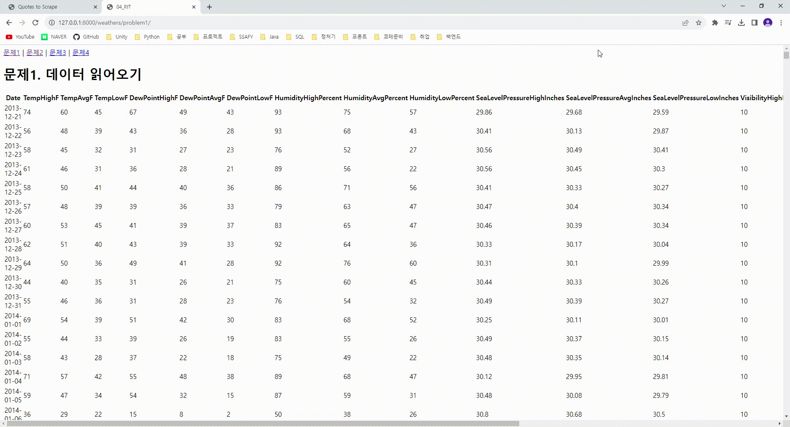

# 관통 프로젝트(PJT)
## PJT01
### API활용, json처리
**API** 
프로그램들이 서로 상호작용하는 것을 도와주는 매개체 
하나의 꽃집(데이터베이스) 
꽃의 다양한 정보(꽃 공급 농장주, 꽃 이름, 색깔, 가격, ..-> 데이터) 
꽃집 관리자(API) 
꽃집 방문 손님이나 꽃집 회계사, 주인, 파트너(요청자, 어플리케이션) 

**json** 
Javascript 객체 문법으로 구조화된 데이터를 표현하기 위한 문자 기반의 표준 포맷 
일반적으로 서버에서 클라이언트로 데이터를 보낼 때 사용하는 양식 
클라이언트가 사용하는 언어에 관계 없이 통일된 데이터를 주고받을 수 있도록 
일정한 패턴을 지닌 문자열을 생성해 내보내면 클라이언트는 그를 해석해 데이터를 자기만의 방식으로 온전히 저장, 표시할 수 있게 된다. 
 

## PJT02
### numpy, pandas, matplotlib 기본활용
---
**numpy** 
행렬/배열 처리 및 연산 
1. 기존 배열을 numpy array로 변형
2. Numpy 배열 생성
- 기본 배열 생성
- 2차원 배열 생성
- 0으로만 이루어진 배열 생성
- 1로만 이루어진 배열 생성
- 특정 수로 이루어진 배열 생성
- 균일한 간격의 숫자 생성
- 랜덤한 값 생성
3. 기본 함수
4. Indexing & Slicing
5. 배열 값 수정 & 복사하기
 

**pandas** 
1. numpy를 활용한 csv file open
2. pandas dataframe 생성
3. 기본 함수
- 처음 n개 행 표시
- 마지막 5개 행 표시
- 헤더 이름 지정하기
- 데이터 타입 반환
- dataframe의 정보 출력
- 컬럼 별 요약 통계량 출력
- 특정 데이터 조회
- 행 삽입하기
- 열 삽입하기
- 행 삭제
- 열 삭제
- dataframe 복사
 

**matplotlib** 
1. matplotlib 기본 사용법(라인 그래프 그리기)
2. 두가지 선 그리기
3. 막대 그래프 그리기
4. 히스토그램 그리기
 

## PJT03
부트스트랩을 활용한 반응형 웹페이지 제작
 

## PJT04
django와 matplotlib 결합

 

## PJT05
