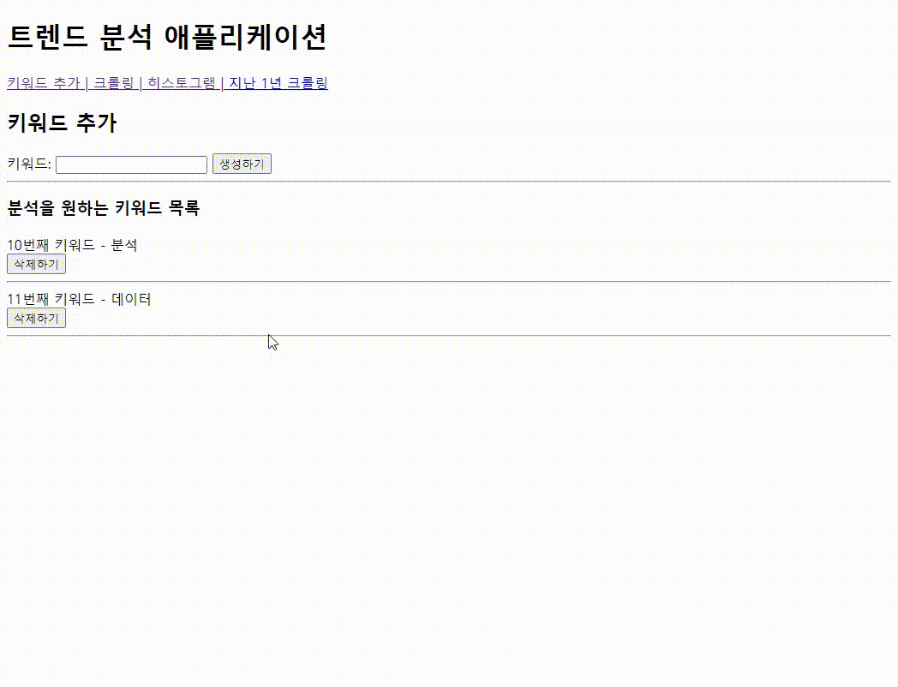

# 관통 프로젝트(PJT)
## PJT01
### API활용, json처리
**API** 
프로그램들이 서로 상호작용하는 것을 도와주는 매개체 
하나의 꽃집(데이터베이스) 
꽃의 다양한 정보(꽃 공급 농장주, 꽃 이름, 색깔, 가격, ..-> 데이터) 
꽃집 관리자(API) 
꽃집 방문 손님이나 꽃집 회계사, 주인, 파트너(요청자, 어플리케이션) 

**json** 
Javascript 객체 문법으로 구조화된 데이터를 표현하기 위한 문자 기반의 표준 포맷 
일반적으로 서버에서 클라이언트로 데이터를 보낼 때 사용하는 양식 
클라이언트가 사용하는 언어에 관계 없이 통일된 데이터를 주고받을 수 있도록 
일정한 패턴을 지닌 문자열을 생성해 내보내면 클라이언트는 그를 해석해 데이터를 자기만의 방식으로 온전히 저장, 표시할 수 있게 된다. 
 

## PJT02
### numpy, pandas, matplotlib 기본활용
**numpy** 
행렬/배열 처리 및 연산 
1. 기존 배열을 numpy array로 변형
2. Numpy 배열 생성
- 기본 배열 생성
- 2차원 배열 생성
- 0으로만 이루어진 배열 생성
- 1로만 이루어진 배열 생성
- 특정 수로 이루어진 배열 생성
- 균일한 간격의 숫자 생성
- 랜덤한 값 생성
3. 기본 함수
4. Indexing & Slicing
5. 배열 값 수정 & 복사하기
 

**pandas** 
1. numpy를 활용한 csv file open
2. pandas dataframe 생성
3. 기본 함수
- 처음 n개 행 표시
- 마지막 5개 행 표시
- 헤더 이름 지정하기
- 데이터 타입 반환
- dataframe의 정보 출력
- 컬럼 별 요약 통계량 출력
- 특정 데이터 조회
- 행 삽입하기
- 열 삽입하기
- 행 삭제
- 열 삭제
- dataframe 복사
 

**matplotlib** 
1. matplotlib 기본 사용법(라인 그래프 그리기)
2. 두가지 선 그리기
3. 막대 그래프 그리기
4. 히스토그램 그리기
 

## PJT03
부트스트랩을 활용한 반응형 웹페이지 제작
 
 

## PJT04
### django와 matplotlib 결합
1. problem1
- pandas를 활용하여 캐글에서 다운받은 파일을 DataFrame으로 읽어온다
- 전체 데이터를 표 형태로 출력한다
 
 

2. problem2
- 일별 최고, 평균, 최저 온도를 선 그래프로 출력한다
    - 날짜 필드: 날짜 형식으로 변환하여 사용
 
 

3. problem3
- 월별 최고, 평균, 최저 온도의 평균을 선 그래프로 시각화한다
    - 날짜 필드: 날짜 형식으로 변환하여 사용
    - 온도 필드: 평균값 계산을 위해 숫자 형식으로 변환하여 사용
 
 

4. problem4
- 가상 현상 발생횟수를 bar그래프로 출력한다
    - 사용되는 Events 컬럼은 "결측치"가 포함되어 있으며 "다중값을 허용"한다
    - 다중값은 각 기상 현상의 발생 횟수에 추가하여 계산
      ex) "Rain, Thunderstorm" = "Rain+1, Thunderstorm+1" 로 계산

 
 

 
 

## PJT05
### django와 matplotlib 결합
1. keyword.html
- 검색하고자 하는 키워드를 추가 및 삭제할 수 있도록 구성한다
- 생성하기 및 삭제하기 버튼을 통해 Keyword테이블에 데이터를 저장 및 삭제하도록 구성한다
 
 

2. crawling.html
- Keyword 테이블에 저장된 키워드들을 활용하여 크롬 검색 결과 페이지 크롤링을 수행한다
- 페이지의 정보 중 "검색 결과 개수"를 추출하여 Trend 테이블에 저장한다
- 저장 시 이미 저장되어 있는 키워드라면 새로 생성하지 않고 검색 결과 개수를 변경한다
 
 

3. crawling_histogram.html
- 전체 기간 검색 결과를 활용하여 막대 그래프를 출력한다
- 크롤링을 다시 진행하지 않고 Trend에 저장된 데이터를 활용한다
 
 

 
 

## PJT05
### 금융상품정보 API Server 제작
1. 정기예금 상품 목록 및 옵션 목록 저장
- 정기예금 API로부터 전달받은 데이터 중 상품 목록 정보와 옵션 목록 정보를 DB에 저장한다
 
 

2. 전체 정기예금 상품 목록 출력
- 아래 URL로 요청이 오면 DB에 저장된 정기예금 상품목록을 반환하도록 코드를 구현한다
- url: finlife/deposit-products/
- method: get
 
 

3. 정기예금 상품 추가하기
- 아래 URL로 요청이 오면 요청과 함께 전송한 데이터를 DB에 저장하도록 코드를 구현한다
- url: finlife/deposit-products/
- method: post
 
 

4. 특정 상품의 옵션 리스트 출력
- 아래 URL로 요청이 오면 상품 코드에 따라 해당 상품의 옵션 리스트를 출력하도록 코드를 구현한다
- url: finlife/deposit-product-options/<str:fin_prdt_cd>/
- method: get
 
 

5. 금리가 가장 높은 상품의 정보 출력
- 아래 URL로 요청이 오면 금리가 가장 높은 상품의 상세정보와 옵션을 반환하도록 코드를 구현한다
- url: finlife/deposit-products/top-rate/
- method: get
